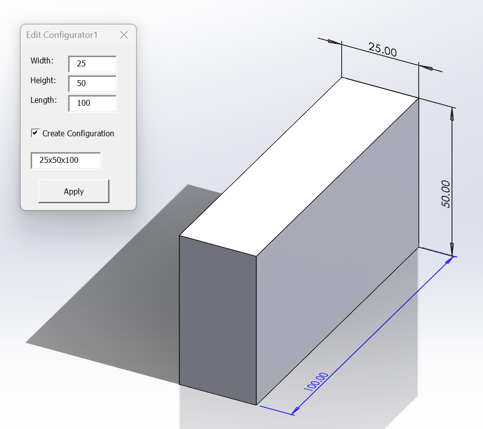

This VBA macro leverages functionality of macro feature to create custom model configurator for the specified dimensions.



Macro will build dynamic User Interface for the specified dimension and insert the **Configurator** feature directly in the Feature Manager tree.

{ width=500 }

Design can be modified at any time by clicking **Edit Feature** command

Feature can also be edited in the context of the assembly.

To insert the feature, pre-select dimensions you want to be configured and run the macro.

For each selected dimension specify the user friendly title (this will be displayed on the form):

Once inserted. Edit the definition of the feature to update the model.

Configurator feature can be inserted into the part or assembly (including inserting to the component edited in the context of the assembly).

Dimensions will be modified in the active configuration or in the referenced configuration of the component (if edited in context)

When adding configurator feature to the assembly it is possible to modify the dimensions of any sub-component.

Macro has an option to create a configuration for specified parameters. Once **Create Configuration** option is checked, specify the name of the configuration in the text box below.

> When configuration is created for the component edited in the context of the assembly, referenced configuration of the component is automatically changed to a new configuration

## Configuration

User can modify the constants below to change some of the parameters.

* **BASE_NAME** constants defines the default name used for the configurator feature
* **EMBED_MACRO_FEATURE** allows to embed the code directly to the model, so it is no longer linked to the original macro. This model can be shared with anyone and edited without the need to supply the original macro

~~~ vb
Public Const BASE_NAME As String = "MyConfigurator" 'default name for the feature

Const EMBED_MACRO_FEATURE As Boolean = True' embeds macro feature into the model
~~~

## Benefits Comparison

Table below demonstrates the benefits of this approach compared to other poplar design automation methods and tools.

> Note, the table below only shows benefits of this macro compared to other methods. Other methods have more benefits and features which this macro does not cover and those are not included into the table below

| Feature  | This Macro | Equations  | Design Table  | DriveWorks |
|---|---|---|---|---|
| Easy to setup  | &check;  | &check;  | &check;  | &cross;  |
| Simple input method  | &check;  | &cross;  | &cross;  | &check;  |
| Performance  | &check;  | &check;  | &cross;  | &cross;  |
| On-demand editing  | &check;  | &check;  | &check;  | &cross;  |
| Sub-components support  | &check;  | &cross;  | &cross;  | &check;  |
| In-context editing  | &check;  | &cross;  | &cross;  | N/A  |
| Extensibility  | &check;  | &cross;  | &cross;  | &check;  |

### Easy to setup

This criteria defines how quickly the configurator can be created. DriveWorks requires specific skills and rules engine to create a configurator, while this macro only requires dimensions preselection

### Simple input method

This criteria defines how easy it is to apply and change the dimensions as per configurator input parameters. Both this macro and DriveWorks will use custom forms which simplifies the input while Equations and Design Table do not have a specific input form and it is required to search for the specific inputs through the list of other equations and definitions.

### Performance

This criteria defines the execution performance (how long it takes before parameters are applied). This macro applies parameters instantly directly to dimension. Design Table needs to load Excel instance and open the file to recalculate and apply value. DriveWorks will always generate new model based on the specification inputs.

### On-demand editing

This criteria defines if parameters can be changed to the existing design. DriveWorks generates new model and does not modify existing one.

### Sub-components support

This criteria defines if parameters of the sub component can be modified. Although Equations can be defined for the components those are not configuration specific, i.e. it will not be possible to have two instances of the component with different configurations and different equation values.

### In-context editing

This criteria defines if configuration of the component can be changed using in-context editing from the top level assembly. All of the methods except this macro requires the target component to be opened in its own window in order to be edited, while this macro allows in-context editing.

### Extensibility

This criteria defines the possibility to extend the functionality beyond the out-of-the box functionality. Both Equations and DesignTable are built-in features. DriveWorks provides APIs and can be extended. This macro is open source and can be extended using SOLIDWORKS API.

## Macro Setup

* Create new macro and copy the code below:



Add new [User Form](/visual-basic/user-forms/) and place the code below into the form's code behind



Specify the name for the form to be **ConfiguratorForm**. As the result the solution tree in VBA will look like below:

